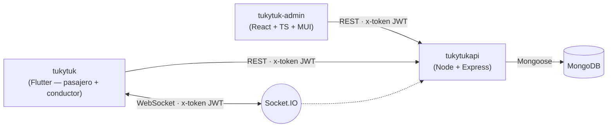
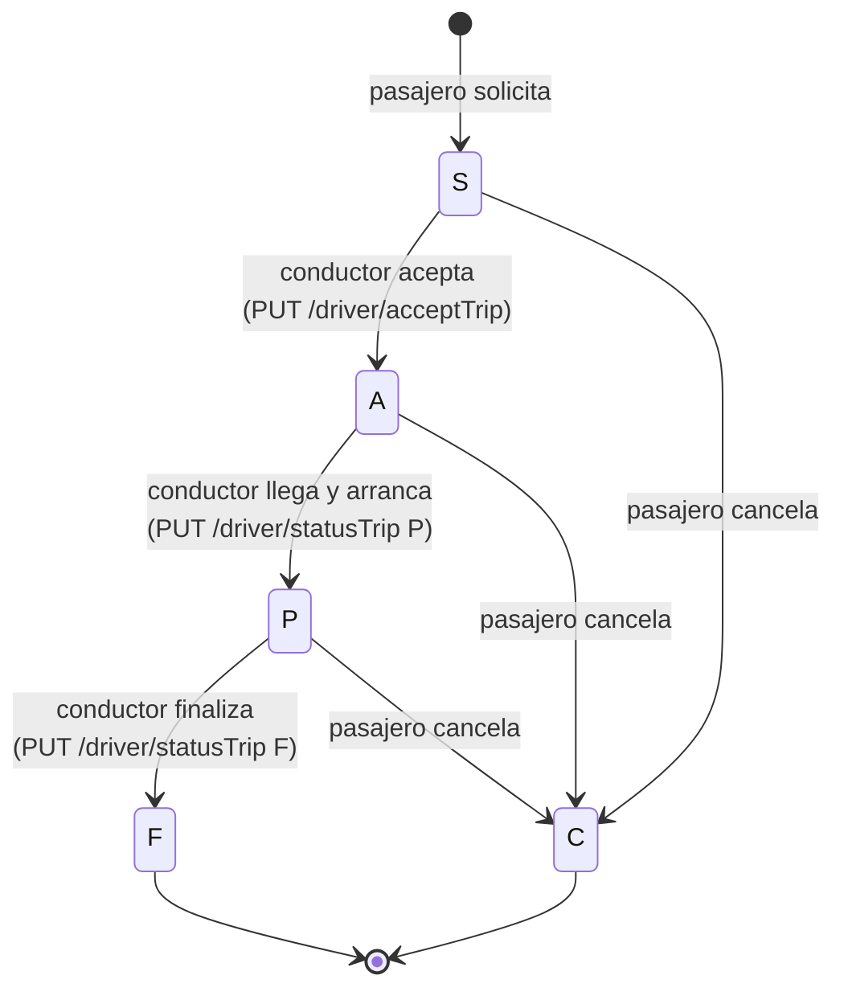
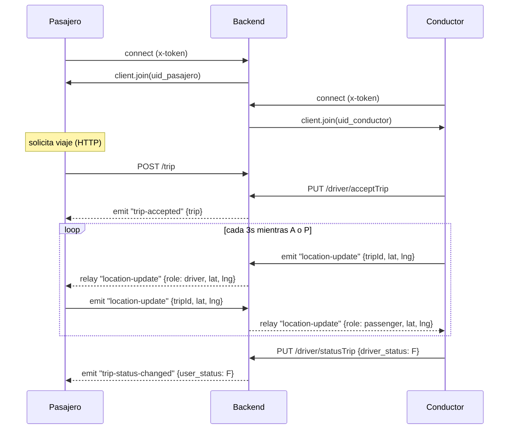
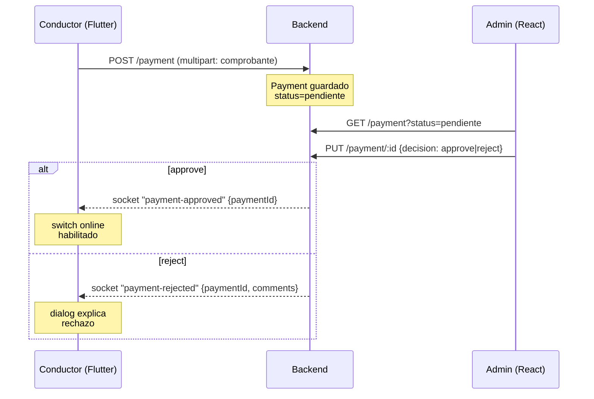

# Monorepo docs reorg + READMEs + ARCHITECTURE Implementation Plan

> **For agentic workers:** REQUIRED SUB-SKILL: Use superpowers:subagent-driven-development (recommended) or superpowers:executing-plans to implement this plan task-by-task. Steps use checkbox (`- [ ]`) syntax for tracking.

**Goal:** Mover los docs IA (`docs/superpowers/`) desde `tukytukapi/` a la raíz del monorepo, crear READMEs uniformes para los 3 subproyectos y producir `docs/ARCHITECTURE.md` con 4 diagramas Mermaid en la raíz.

**Architecture:** Pura reorganización de documentación. Ningún código de los subproyectos se toca. Un solo commit en `tukytukapi/` por la eliminación del directorio movido; READMEs nuevos en los 3 subproyectos quedan listos para que el usuario commitee a discreción.

**Tech Stack:** Markdown + Mermaid (texto, sin imágenes binarias).

## Global Constraints

- Idioma: TODO en español — comentarios de commit y contenido de docs.
- NO se toca código de ningún subproyecto.
- La raíz `/Users/yordiguevara/Documents/GitHub/TukyTuk/` NO es repo git — operaciones de filesystem únicamente, sin commits.
- READMEs nuevos en `tukytuk/` y `tukytuk-admin/` quedan staged (no commiteados) — el usuario decide cuándo.
- Spec de referencia: `tukytukapi/docs/superpowers/specs/2026-06-17-monorepo-docs-readmes-design.md`.

---

### Task 1: Mover `tukytukapi/docs/superpowers/` → raíz del monorepo

**Files:**
- Mover: `tukytukapi/docs/superpowers/` → `docs/superpowers/` (raíz monorepo).
- Modificar: árbol de archivos de `tukytukapi/` (commit del `git rm -r`).

**Interfaces:**
- Produces: `docs/superpowers/` ya disponible en raíz para Tasks 2-5 que la referencian en READMEs/ARCHITECTURE.

- [ ] **Step 1: Verificar destino no existe**

```bash
ls /Users/yordiguevara/Documents/GitHub/TukyTuk/docs 2>&1
```

Esperado: `ls: ... No such file or directory` (o sin subcarpeta `superpowers`). Si el destino ya existiera, el `mv` fallaría — abortar y consultar.

- [ ] **Step 2: Mover el directorio**

```bash
mkdir -p /Users/yordiguevara/Documents/GitHub/TukyTuk/docs
mv /Users/yordiguevara/Documents/GitHub/TukyTuk/tukytukapi/docs/superpowers /Users/yordiguevara/Documents/GitHub/TukyTuk/docs/superpowers
```

- [ ] **Step 3: Verificar el move**

```bash
ls /Users/yordiguevara/Documents/GitHub/TukyTuk/docs/superpowers/specs/ | head -3
ls /Users/yordiguevara/Documents/GitHub/TukyTuk/docs/superpowers/plans/ | head -3
test -d /Users/yordiguevara/Documents/GitHub/TukyTuk/tukytukapi/docs/superpowers && echo "ERROR: aún existe" || echo "OK: movido"
```

Esperado: los `ls` listan archivos; el último imprime `OK: movido`.

- [ ] **Step 4: Verificar que `tukytukapi/docs/` queda vacío y limpiarlo si aplica**

```bash
ls /Users/yordiguevara/Documents/GitHub/TukyTuk/tukytukapi/docs 2>&1
```

Si está vacío o solo tiene archivos auxiliares no relevantes, dejar el directorio. NO eliminar otros archivos.

- [ ] **Step 5: Commit en `tukytukapi/`**

```bash
cd /Users/yordiguevara/Documents/GitHub/TukyTuk/tukytukapi
git add -A docs/
git status --short
```

Esperado en `git status`: listas de `D docs/superpowers/...` (deleted). Si aparecen otros cambios no relacionados (en `controllers/`, `models/`, etc.), abortar y consultar.

```bash
git commit -m "docs: mover docs/superpowers/ a la raíz del monorepo

Specs y planes son del monorepo completo, no solo del backend.
Ahora viven en ~/Documents/GitHub/TukyTuk/docs/superpowers/ donde
cualquier agente que edite cualquier subproyecto los encuentra."
```

---

### Task 2: `tukytukapi/README.md` — nuevo

**Files:**
- Create: `tukytukapi/README.md`

**Interfaces:**
- Consumes: directorio `docs/superpowers/` en raíz (Task 1).

- [ ] **Step 1: Crear el archivo con el contenido completo**

Crear `tukytukapi/README.md`:

```markdown
# tukytukapi

Backend REST + realtime de la plataforma **TukyTuk** (mototaxi). Maneja autenticación, usuarios (pasajeros y conductores), ciclo de vida de viajes, mensajería y pagos.

## Stack

| Componente | Tecnología |
|---|---|
| Runtime | Node.js + Express |
| Base de datos | MongoDB (Mongoose) |
| Realtime | Socket.IO |
| Auth | JWT vía header `x-token` + OTP por email |
| Upload de archivos | Multer (comprobantes de pago) |
| Deploy | AWS EC2 — `http://52.87.214.235` |

## Quick start

```bash
npm install
cp .env.example .env   # editar PORT, DB_CNN, JWT_KEY, SMTP_*
npm run start:dev      # nodemon — auto-reload
npm start              # producción
```

No hay suite de tests automatizados (`npm test` es un placeholder).

## Estructura

```
controllers/    # business logic
helpers/        # email (SMTP), jwt utils
middlewares/   # validar-jwt, validar-campos
models/        # Mongoose schemas (Usuario, Trip, Mensaje, OTPCode, Payment...)
routes/        # Express routers + express-validator
sockets/       # Socket.IO handlers (chat, location-update)
index.js       # wiring principal
```

## Convenciones

- Idioma: español en comentarios, mensajes de error y commits.
- Mongoose `toJSON` sobrescrito en cada modelo: oculta `_id`/`__v`/`password`, expone `uid`.
- Auth: cada ruta protegida usa `validar-jwt` middleware → `req.uid` disponible.
- Sockets: cada usuario entra a la room nombrada por su `uid` al conectarse.

## Reglas del negocio clave

- Un conductor solo puede tener UN viaje activo simultáneo (`driver_status` ∈ {R, P}).
- Cancelación de viaje permitida por el pasajero en estados S, A, P.
- Estados `user_status`: `S` (solicitado), `A` (asignado), `P` (en progreso), `F` (finalizado), `C` (cancelado).
- Estados `driver_status`: `P` (pendiente), `R` (en ruta a recoger), `P` (en progreso con pasajero), `F` (finalizado).

## Para agentes de IA

- Instrucciones globales del monorepo: `../CLAUDE.md`
- Specs y planes de trabajo: `../docs/superpowers/`
- Arquitectura completa con diagramas: `../docs/ARCHITECTURE.md`
```

- [ ] **Step 2: Verificar**

```bash
test -f /Users/yordiguevara/Documents/GitHub/TukyTuk/tukytukapi/README.md && head -3 /Users/yordiguevara/Documents/GitHub/TukyTuk/tukytukapi/README.md
```

Esperado: `# tukytukapi` + descripción.

- [ ] **Step 3: Commit en `tukytukapi/`**

```bash
cd /Users/yordiguevara/Documents/GitHub/TukyTuk/tukytukapi
git add README.md
git commit -m "docs: README inicial del backend tukytukapi"
```

---

### Task 3: `tukytuk/README.md` — sobrescribir boilerplate

**Files:**
- Overwrite: `tukytuk/README.md`

**Interfaces:**
- Consumes: directorio raíz con `CLAUDE.md` y `docs/superpowers/`.

- [ ] **Step 1: Sobrescribir el archivo con el contenido completo**

Sobrescribir `tukytuk/README.md`:

```markdown
# tukytuk

App Flutter de la plataforma **TukyTuk** (mototaxi). Una sola base de código sirve tanto el flujo del **pasajero** como el del **conductor**, decidido por `Usuario.type` (`'U'` pasajero, `'C'` conductor).

## Stack

| Componente | Tecnología |
|---|---|
| Framework | Flutter |
| State | `provider` (ChangeNotifier) + `flutter_bloc` |
| Maps | `google_maps_flutter` + `flutter_map` (Leaflet/OSM en algunos previews) |
| Rutas / tráfico | Mapbox Directions API |
| Realtime | `socket_io_client` |
| HTTP | `dio` con interceptors (places, traffic) |
| Storage | `flutter_secure_storage` |
| Plataformas | Android + iOS + web |

## Quick start

```bash
flutter pub get
flutter run                          # device/emulator conectado
flutter analyze                      # lint
flutter test                         # widget/unit tests en test/
flutter build apk                    # Android
flutter gen-l10n                     # regenerar localizations (lib/l10n/*.arb)
```

Variables sensibles (token de Mapbox, etc.) vienen de `.env` o están hardcoded en `lib/const/general.dart` (`Constants.apiUrl`, `Constants.socketUrl`, `Constants.googleApiKey`).

Si `flutter run` falla con `Gradle task assembleDebug failed with exit code 1` sin output útil: `cd android && ./gradlew --stop` y reintentar (daemons con JVMs incompatibles).

## Estructura

```
lib/
├── blocs/        # flutter_bloc — GpsBloc, LocationBloc, MapBloc, SearchBloc
├── services/     # ChangeNotifier — AuthService, SocketService, ChatService, TripService, PaymentService
├── providers/    # LocaleProvider (i18n)
├── pages/        # vistas (home, login, register, trip_driver, payment_driver…)
├── screens/      # mapas fullscreen (map_screen pasajero, map_driver_screen conductor)
├── widgets/      # componentes (TripCard, drawer, btn_primary, trip_preview_sheet…)
├── helpers/      # confirm dialogs, etc.
├── models/       # Trip, Usuario, Payment, etc.
├── routes/       # routes.dart con mapa flat de rutas nombradas
├── l10n/         # *.arb (en, es)
└── main.dart     # MultiProvider + MaterialApp
```

## Convenciones

- Idioma: español en UI, comentarios y mensajes de commit. Strings en `.arb` cuando son user-facing y localizables.
- State híbrido: providers (`ChangeNotifier`) para sesión/sockets/trip; BLoCs para mapa/GPS/búsqueda.
- Pasajero vs conductor: pages/screens sufijadas según rol (`home_passanger_page.dart` vs `home_page.dart` que ya es del conductor).
- `socket_service.dart` (extensión simple) — atención: el archivo puede tener nombre con doble extensión en algunos commits, pero la convención correcta es `socket_service.dart`.

## Reglas del negocio clave

- Estados de viaje (`Trip.userStatus`): `S` solicitado → `A` asignado → `P` en progreso → `F` finalizado. Terminal alterno: `C` cancelado.
- Si el conductor tiene viaje activo, NO ve la lista de disponibles (regla del negocio + filtro defensivo en backend).
- Switch online del conductor: gated por pago vigente.

## Para agentes de IA

- Instrucciones globales del monorepo: `../CLAUDE.md`
- Specs y planes de trabajo: `../docs/superpowers/`
- Arquitectura completa con diagramas: `../docs/ARCHITECTURE.md`
```

- [ ] **Step 2: Verificar**

```bash
head -5 /Users/yordiguevara/Documents/GitHub/TukyTuk/tukytuk/README.md
```

Esperado: empieza con `# tukytuk` (no `# tukytuk\n\nA new Flutter project.`).

- [ ] **Step 3: NO commit**

El usuario decide cuándo commitear los cambios en `tukytuk/`. Dejar el archivo modificado (`git status` mostrará `M README.md`).

---

### Task 4: `tukytuk-admin/README.md` — sobrescribir boilerplate

**Files:**
- Overwrite: `tukytuk-admin/README.md`

**Interfaces:**
- Consumes: raíz monorepo.

- [ ] **Step 1: Sobrescribir el archivo con el contenido completo**

Sobrescribir `tukytuk-admin/README.md`:

```markdown
# tukytuk-admin

Dashboard web administrativo de **TukyTuk**. Gestión de usuarios (pasajeros y conductores), aprobación/rechazo de pagos y monitoreo general.

## Stack

| Componente | Tecnología |
|---|---|
| Framework | React 18 + TypeScript |
| Build | Vite |
| UI | Material-UI (MUI) |
| Routing | React Router v6 |
| Auth | JWT vía header `x-token` (mismo backend que la app) |
| Deploy | bundle estático servido como `dist/` |

## Quick start

```bash
npm install
cp .env.example .env.local   # apuntar a backend
npm run dev                  # vite, normalmente :5173
npm run build                # tsc -b && vite build → dist/
npm run lint                 # eslint con --max-warnings 0
npm run preview              # servir dist/ localmente
```

`lint` está configurado con `--max-warnings 0` → cualquier warning rompe el build.

## Estructura

```
src/
├── admin/        # módulos del dashboard (users, payments…)
├── auth/         # login/registro de admin
├── journal/      # leftover del template original — la mayoría de rutas vienen aquí
├── router/       # AppRouter.jsx, AuthRoutes, JournalRoutes (mid-migración a TSX)
├── store/        # estado global si aplica
├── helpers/      # utils
└── main.tsx      # entry
```

> **Nota histórica:** este repo fue inicializado desde un tutorial de "Journal" — algunos nombres (`journal/`, `JournalRoutes`) no reflejan el dominio admin. El código real de admin vive en `src/admin/`.

## Convenciones

- Idioma: español en UI, comentarios y mensajes de commit.
- Codebase mid-migración de `.jsx` a `.tsx` — código nuevo debe ser TypeScript.
- `--max-warnings 0`: arreglar TODOS los warnings antes de comitear.

## Para agentes de IA

- Instrucciones globales del monorepo: `../CLAUDE.md`
- Specs y planes de trabajo: `../docs/superpowers/`
- Arquitectura completa con diagramas: `../docs/ARCHITECTURE.md`
```

- [ ] **Step 2: Verificar**

```bash
head -5 /Users/yordiguevara/Documents/GitHub/TukyTuk/tukytuk-admin/README.md
```

Esperado: empieza con `# tukytuk-admin` (no `# React + TypeScript + Vite`).

- [ ] **Step 3: NO commit**

Mismo criterio: usuario decide.

---

### Task 5: `docs/ARCHITECTURE.md` en raíz — con 4 diagramas Mermaid

**Files:**
- Create: `/Users/yordiguevara/Documents/GitHub/TukyTuk/docs/ARCHITECTURE.md`

**Interfaces:**
- Consumes: directorio `docs/` ya existe (de Task 1).

- [ ] **Step 1: Crear el archivo con el contenido completo**

Crear `/Users/yordiguevara/Documents/GitHub/TukyTuk/docs/ARCHITECTURE.md`:

````markdown
# TukyTuk — Arquitectura

TukyTuk es una plataforma de mototaxi (motorcycle-taxi). Se compone de tres subproyectos independientes que se comunican vía HTTP REST + WebSocket sobre un backend único respaldado por MongoDB.

- **`tukytukapi/`** — Backend Node + Express + MongoDB + Socket.IO.
- **`tukytuk/`** — App móvil/web Flutter, atiende tanto al PASAJERO como al CONDUCTOR (mismo código, ramificado por `Usuario.type`).
- **`tukytuk-admin/`** — Dashboard web React + TypeScript para operadores.

---

## 1. Topología del monorepo



El backend está desplegado en `http://52.87.214.235` (AWS EC2). Los clientes Flutter hardcodean `Constants.apiUrl` / `Constants.socketUrl` en `lib/const/general.dart`.

---

## 2. Ciclo de vida del viaje

Cada viaje tiene dos máquinas de estados (campos `user_status` y `driver_status` en `models/trip.js`). Aquí el de `user_status`, que es el que conduce la UI principal.



**Reglas clave:**
- Un conductor solo puede tener UN viaje activo (`driver_status` ∈ {R, P}) a la vez. El backend filtra defensivamente la lista de viajes disponibles si el conductor ya tiene uno activo.
- La cancelación por parte del pasajero está permitida en S, A y P; el backend emite `trip-status-changed` al conductor cuando aplica.

---

## 3. Flujo en tiempo real

El cliente Flutter se conecta a Socket.IO con el JWT en `x-token`. El backend autentica, lo une a su propia room (su `uid`), y relaya eventos a la contraparte del viaje.



**Eventos importantes:**
- `mensaje-personal` — chat 1-a-1, persistido en `Mensaje`.
- `location-update` — relay del emisor a la contraparte. El backend resuelve el `counterpart` consultando `Trip`.
- `trip-accepted` — backend → pasajero cuando el conductor acepta.
- `trip-status-changed` — backend → contraparte cuando hay un cambio relevante (incluye cancelaciones del pasajero en A/P).
- `payment-approved` / `payment-rejected` — backend → conductor cuando admin actúa.

---

## 4. Suscripción y pagos del conductor

El conductor solo puede ponerse "online" si tiene un pago vigente aprobado.



---

## 5. Convenciones globales

- **Idioma:** español en UI, comentarios y commits.
- **Auth:** JWT `x-token` header. El JWT lleva `{ uid }` y vence en 24h.
- **Naming en backend:** snake_case en modelos Mongoose (`user_status`, `start_lat`, `driver_start_lat`). El `toJSON` traduce `_id` → `uid` y oculta `password`/`__v`.
- **Naming en Flutter:** camelCase en Dart (`userStatus`, `startLat`). Mapping ocurre en `models/trip.dart` factory `fromJson`.
- **Coords:** strings en MongoDB, parseados a `double` en cliente.

---

## 6. Tips para agentes de IA

- Las instrucciones detalladas para Claude/agentes están en `../CLAUDE.md`.
- Los specs y planes de trabajo (historial de diseño + ejecución) en `./superpowers/`.
- Los subproyectos son repos git independientes — el monorepo raíz **no** es un repo git. Cualquier `git` operation se hace dentro del subproyecto que corresponda.
````

- [ ] **Step 2: Verificar el archivo y los diagramas**

```bash
test -f /Users/yordiguevara/Documents/GitHub/TukyTuk/docs/ARCHITECTURE.md && echo "OK existe"
grep -c "^\`\`\`mermaid" /Users/yordiguevara/Documents/GitHub/TukyTuk/docs/ARCHITECTURE.md
```

Esperado: imprime `OK existe` y el `grep -c` retorna `4` (cuatro bloques Mermaid).

- [ ] **Step 3: NO commit**

La raíz no es repo git — no hay commit. El archivo queda como filesystem state.

---

### Task 6: Actualizar memoria de Claude + verificación final

**Files:**
- Modify: `/Users/yordiguevara/.claude/projects/-Users-yordiguevara-Documents-GitHub-TukyTuk/memory/reference_ubicacion-specs.md`
- Modify: `/Users/yordiguevara/.claude/projects/-Users-yordiguevara-Documents-GitHub-TukyTuk/memory/MEMORY.md` (línea de descripción)

**Interfaces:**
- Consumes: la nueva ubicación de `docs/superpowers/` en raíz.

- [ ] **Step 1: Leer la memoria actual**

```bash
cat /Users/yordiguevara/.claude/projects/-Users-yordiguevara-Documents-GitHub-TukyTuk/memory/reference_ubicacion-specs.md 2>&1 | head -30
```

Esperado: archivo existente con la ruta antigua `tukytukapi/docs/superpowers/...`.

- [ ] **Step 2: Sobrescribir el archivo de memoria con la ruta nueva**

Sobrescribir `/Users/yordiguevara/.claude/projects/-Users-yordiguevara-Documents-GitHub-TukyTuk/memory/reference_ubicacion-specs.md`:

```markdown
---
name: ubicacion-specs
description: Specs y planes IA viven en la raíz del monorepo (no en tukytukapi)
metadata:
  type: reference
---

Los specs y planes de trabajo IA del monorepo TukyTuk viven en:

- **Specs**: `~/Documents/GitHub/TukyTuk/docs/superpowers/specs/`
- **Planes**: `~/Documents/GitHub/TukyTuk/docs/superpowers/plans/`

La raíz `~/Documents/GitHub/TukyTuk/` NO es un repo git — es solo un directorio que contiene los tres subproyectos (`tukytuk/`, `tukytukapi/`, `tukytuk-admin/`). Por eso `docs/superpowers/` vive ahí: cualquier agente que edite cualquiera de los subproyectos los encuentra sin saltar entre git repos.

**Antes** (incorrecto hasta 2026-06-17): vivían en `tukytukapi/docs/superpowers/`. Se movieron a la raíz para que no estuvieran atrapados en el repo backend. La historia git de esos archivos sigue en `tukytukapi/` (commit que los removió).
```

- [ ] **Step 3: Actualizar la línea de `MEMORY.md`**

Localizar en `/Users/yordiguevara/.claude/projects/-Users-yordiguevara-Documents-GitHub-TukyTuk/memory/MEMORY.md` la línea:

```
- [Ubicación de specs y planes](reference_ubicacion-specs.md) — los specs viven en `tukytukapi/docs/superpowers/specs/` y los planes en `tukytukapi/docs/superpowers/plans/`
```

Reemplazar por:

```
- [Ubicación de specs y planes](reference_ubicacion-specs.md) — specs y planes IA viven en la raíz: `~/Documents/GitHub/TukyTuk/docs/superpowers/`
```

- [ ] **Step 4: Verificación final del estado del monorepo**

```bash
echo "=== Raíz monorepo ==="
ls /Users/yordiguevara/Documents/GitHub/TukyTuk/docs/
echo
echo "=== READMEs ==="
ls -la /Users/yordiguevara/Documents/GitHub/TukyTuk/tukytukapi/README.md /Users/yordiguevara/Documents/GitHub/TukyTuk/tukytuk/README.md /Users/yordiguevara/Documents/GitHub/TukyTuk/tukytuk-admin/README.md
echo
echo "=== tukytukapi: no debe tener docs/superpowers ==="
test -d /Users/yordiguevara/Documents/GitHub/TukyTuk/tukytukapi/docs/superpowers && echo "ERROR: aún existe" || echo "OK: removido"
echo
echo "=== tukytukapi git log última líneas ==="
cd /Users/yordiguevara/Documents/GitHub/TukyTuk/tukytukapi && git log --oneline -3
```

Esperado:
- `docs/` en raíz contiene `superpowers/` (con `specs/` y `plans/`) y `ARCHITECTURE.md`.
- Los 3 READMEs existen.
- `tukytukapi/docs/superpowers` ya no existe.
- Los últimos 2-3 commits de `tukytukapi/` muestran "docs: mover superpowers" y "docs: README inicial del backend".

- [ ] **Step 5: Reportar**

Si todo OK, no se requiere commit adicional. Si algo no cuadra, ajustar y reportar la causa.
